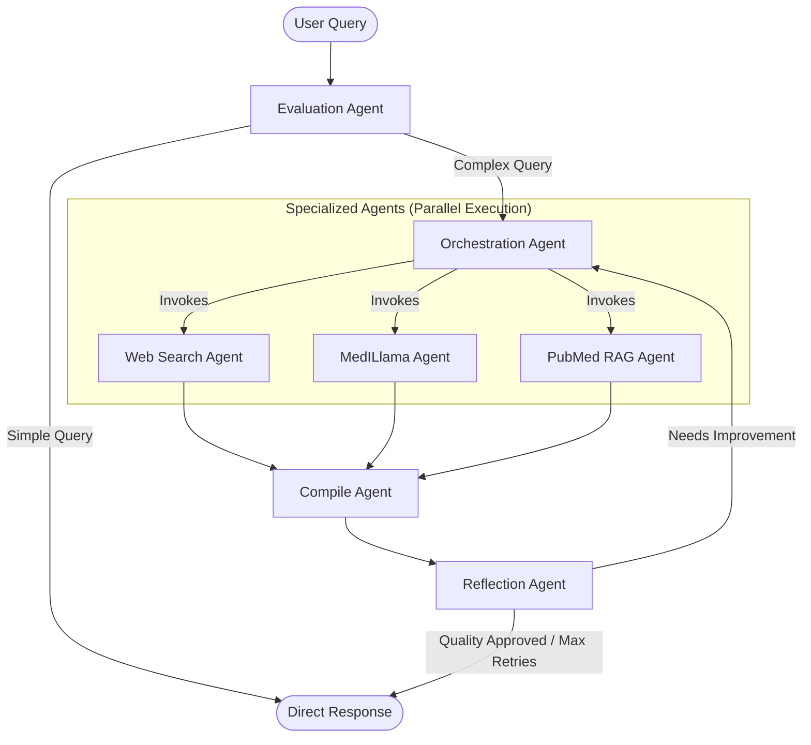
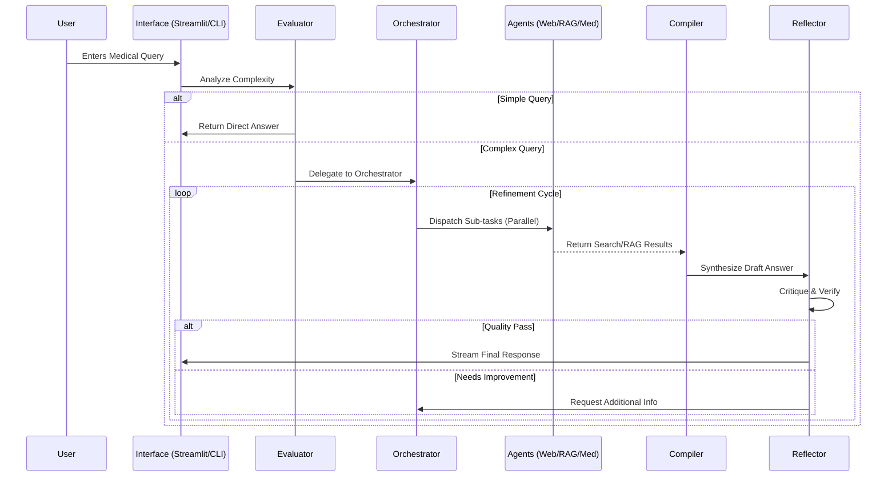

# MedAgent: Intelligent Medical Research Assistant


MedAgent is a sophisticated **multi-agent AI system** designed to revolutionize medical research. By orchestrating a team of specialized agents—capable of web search, PubMed literature review, and domain-specific reasoning—it synthesizes complex medical queries into accurate, comprehensive, and verified answers.

## 🚀 Key Features

*   **🧠 Multi-Agent Orchestration**: Powered by a **LangGraph state machine** that coordinates specialized workers (Web Search, PubMed RAG, MedILlama).
*   **⚡ Real-time Streaming**: Delivers instant feedback with token-by-token responses and live status updates on agent activities.
*   **📚 RAG & Evidence-Based**: Cross-references findings with real-time PubMed literature and clinical trial data.
*   **🔄 Self-Correction**: Features a **Reflection Agent** that critiques and iteratively improves answers to ensure medical accuracy.
*   **💾 Persistent Memory**: Saves conversation history and context using MongoDB.
*   **🌍 Polyglot capabilities**: Processes and generates medical insights in multiple languages (English, Spanish, French, German, Arabic, etc.).
*   **💻 Dual Interfaces**: 
    *   **Web UI**: A polished, interactive Streamlit application.
    *   **CLI**: A robust command-line tool for headless operation.

---

## 🛠️ System Architecture

MedAgent operates as a directed cyclic graph (DCG) where a central planner coordinates specialized tools.

### Workflow Diagram



### Request Sequence



---

## 🎥 Demo


---

## 🚀 Getting Started

### Prerequisites

*   **Python 3.10+**
*   **MongoDB**: Local instance or Atlas cluster.
*   **API Keys**:
    *   `GROQ_API_KEY`: For the core LLM engine.
    *   `TAVILY_API_KEY`: For real-time web search.
    *   `NCBI_EMAIL`: For PubMed API access.

### Installation

1.  **Clone the repository**
    ```bash
    git clone https://github.com/Mohammed-saber1/MedAgent.git
    cd MedAgent
    ```

2.  **Set up Virtual Environment**
    ```bash
    python -m venv venv
    source venv/bin/activate  # Windows: venv\\Scripts\\activate
    ```

3.  **Install Dependencies**
    ```bash
    pip install -r requirements.txt
    ```

4.  **Configuration**
    Create a `.env` file in the root directory:
    ```env
    GROQ_API_KEY=your_groq_api_key
    TAVILY_API_KEY=your_tavily_api_key
    MONGODB_URI=mongodb://localhost:27017
    MONGODB_DB_NAME=medagent
    NCBI_EMAIL=your.email@example.com
    ```

### Usage

**Option 1: Web Interface (Recommended)**
Launch the interactive Streamlit app:
```bash
streamlit run streamlit_app.py
```
> Access at `http://localhost:8501`

**Option 2: Command Line Interface**
Run the terminal-based interactive mode:
```bash
python src/main.py
```

**Option 3: API Server**
Start the FastAPI backend:
```bash
uvicorn src.server.app:app --reload
```
> Docs at `http://localhost:8000/docs`

---

## 📂 Project Structure

```text
MedAgent/
├── src/
│   ├── agents/          # Agent Logic (Web, RAG, Orchestrator, etc.)
│   ├── server/          # FastAPI Backend
│   ├── schemas/         # Pydantic Data Models
│   ├── utils/           # Prompts & Helpers
│   ├── config.py        # Environment Configuration
│   ├── agent_graph.py   # LangGraph Workflow Definition
│   └── main.py          # CLI Entry Point
├── tests/               # Unit & Integration Tests
├── streamlit_app.py     # Frontend Application
└── requirements.txt     # Python Dependencies
```

## 🤝 Contributing

Contributions are welcome! Please open an issue or submit a pull request for any improvements.

1.  Fork the Project
2.  Create your Feature Branch (`git checkout -b feature/AmazingFeature`)
3.  Commit your Changes (`git commit -m 'Add some AmazingFeature'`)
4.  Push to the Branch (`git push origin feature/AmazingFeature`)
5.  Open a Pull Request

## 📄 License

This project is licensed under the MIT License.

## 👨‍💻 Author

**Mohammed Saber**

*   **Email**: [mohammed.saber.business@gmail.com](mailto:mohammed.saber.business@gmail.com)
*   **LinkedIn**: [Mohammed Saber](https://www.linkedin.com/in/mohamedsaber14/?isSelfProfile=true)
*   **GitHub**: [Mohammed-saber1](https://github.com/Mohammed-saber1)
