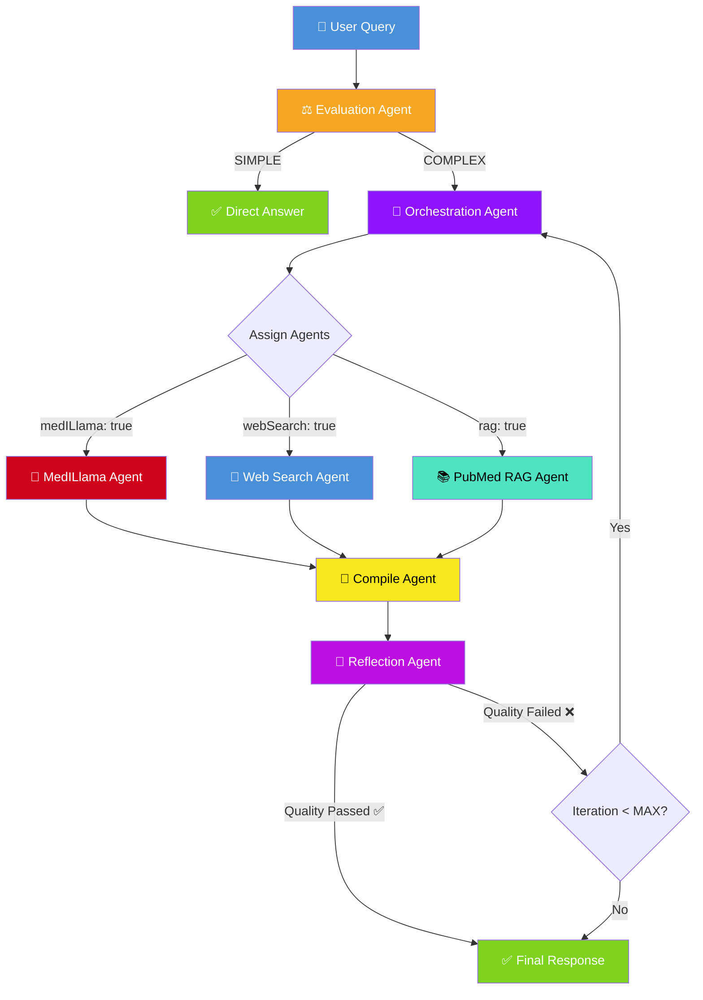
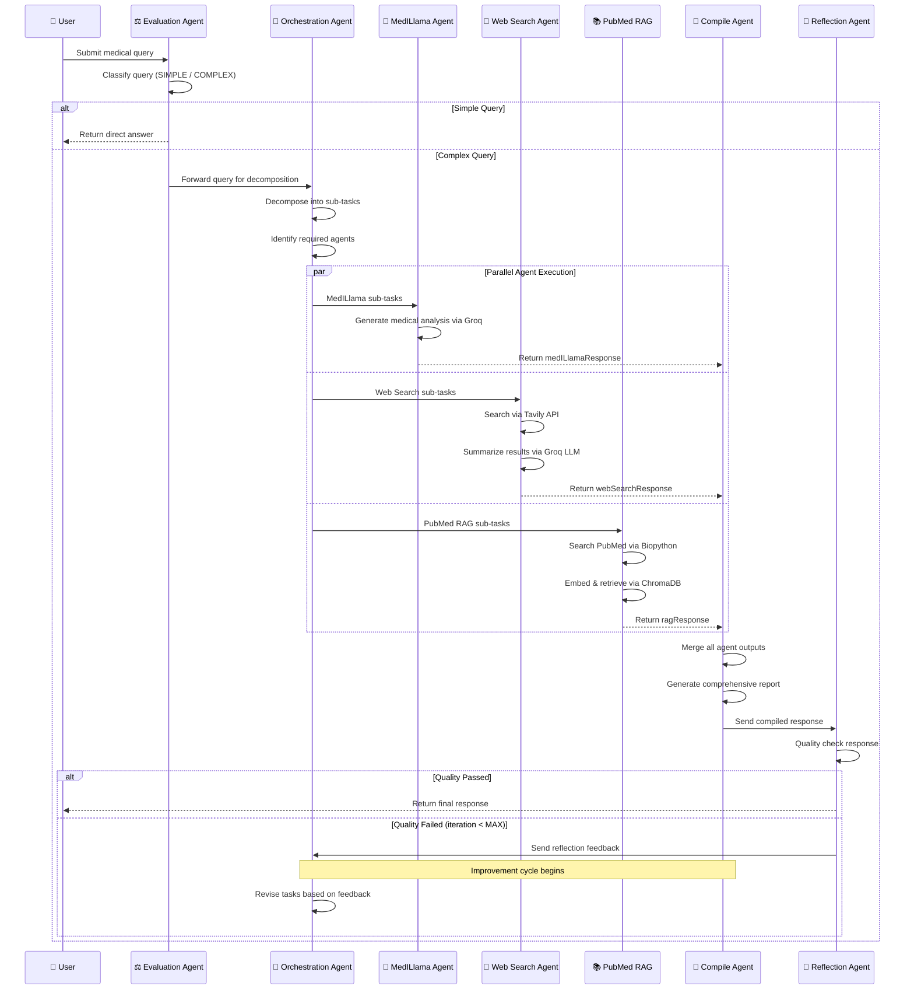
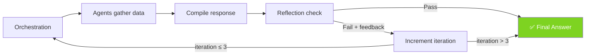

# 🏥 Medical Research Assistant

A **multi-agent AI system** designed to answer complex medical queries with accuracy, depth, and up-to-date information. It dynamically orchestrates specialized AI agents — each with a unique role — to decompose, research, compile, and quality-check medical responses using real-time web data and domain-specific medical models.

> **⚠️ Disclaimer**  
> This system is intended for **research and educational purposes only**. Its outputs are *not* professional medical advice. Always consult a licensed healthcare provider for medical decisions.

---

## 📑 Table of Contents

- [Core Concepts](#-core-concepts)
- [Architecture Overview](#-architecture-overview)
- [Agent Workflow Flowchart](#-agent-workflow-flowchart)
- [Sequence Diagram](#-sequence-diagram)
- [Detailed Agent Descriptions](#-detailed-agent-descriptions)
- [Iteration & Feedback Loop](#-iteration--feedback-loop)
- [Tech Stack](#-tech-stack)
- [Project Structure](#-project-structure)
- [Installation & Setup](#-installation--setup)
- [Usage](#-usage)
- [Configuration](#-configuration)
- [API Reference](#-api-reference)
- [Example Queries](#-example-queries)
- [Roadmap](#-roadmap)
- [License & Disclaimer](#-license--disclaimer)

---

## 🧠 Core Concepts

### What Problem Does This Solve?

Medical queries are rarely simple. A question like *"Compare SGLT2 inhibitors vs GLP-1 receptor agonists for Type 2 Diabetes"* requires:
- **Domain expertise** (clinical knowledge of drug mechanisms)
- **Current research** (latest clinical trials, FDA approvals)
- **Literature review** (PubMed abstracts, peer-reviewed studies)
- **Quality assurance** (fact-checking against medical guidelines)

No single AI model excels at all of these. This system solves the problem by **decomposing complex queries into sub-tasks** and assigning each to a specialized agent, then synthesizing the results into a comprehensive, cited report.

### Key Design Principles

| Principle | Description |
|---|---|
| **Multi-Agent Architecture** | Each agent has a single responsibility (evaluation, search, analysis, compilation, quality control) |
| **Parallel Execution** | Agents run concurrently via LangGraph, minimizing total response time |
| **Iterative Refinement** | A reflection loop detects gaps and triggers re-research cycles (up to 3 iterations) |
| **Unified LLM Strategy** | Groq (Llama 3.3 70B) powers all agents — orchestration, medical analysis, compilation, and reflection |
| **Evidence-Based** | Web search and PubMed RAG provide cited, verifiable references |

---

## 🏗 Architecture Overview

The system is built around a **LangGraph state machine** that routes a user query through a pipeline of specialized agents. The workflow is defined as a directed graph with conditional edges that enable branching (simple vs. complex queries) and looping (reflection feedback).

```
User Query
    │
    ▼
┌──────────────┐    Simple    ┌──────────────┐
│  Evaluation  │─────────────▶│  Direct      │──▶ Final Answer
│  Agent       │              │  Response    │
└──────┬───────┘              └──────────────┘
       │ Complex
       ▼
┌──────────────┐
│ Orchestration│───── Decomposes query into sub-tasks
│ Agent        │───── Assigns agents & generates plan
└──────┬───────┘
       │
       ├──────────────────┬──────────────────┐
       ▼                  ▼                  ▼
┌──────────────┐  ┌──────────────┐  ┌──────────────┐
│  MedILlama   │  │  Web Search  │  │  PubMed RAG  │
│  Agent       │  │  Agent       │  │  Agent       │
│ (Groq)       │  │ (Tavily)     │  │ (Biopython)  │
└──────┬───────┘  └──────┬───────┘  └──────┬───────┘
       │                  │                  │
       └──────────────────┴──────────────────┘
                          │
                          ▼
                  ┌──────────────┐
                  │   Compile    │──▶ Synthesizes all outputs
                  │   Agent      │    into a unified report
                  └──────┬───────┘
                         │
                         ▼
                  ┌──────────────┐    Pass
                  │  Reflection  │──────────▶ Final Answer
                  │  Agent       │
                  └──────┬───────┘
                         │ Fail (feedback)
                         │
                         └──────▶ Back to Orchestration
                                  (up to 3 iterations)
```

---

## 📊 Agent Workflow Flowchart



---

## 🔄 Sequence Diagram



---

## 🤖 Detailed Agent Descriptions

### 1. Evaluation Agent
| Property | Detail |
|---|---|
| **File** | `src/agents/evaluation_agent.py` |
| **LLM** | Groq (Llama 3.3 70B) |
| **Purpose** | Classify queries as SIMPLE or COMPLEX |

- **Simple queries** (e.g., *"What is hypertension?"*) receive an immediate, direct answer without invoking other agents.
- **Complex queries** (e.g., *"Compare treatments for T2D with cardiovascular risk"*) are forwarded to the Orchestration Agent for multi-agent processing.
- Uses `queryEvaluationPrompt` with few-shot examples to classify accurately.

### 2. Orchestration Agent
| Property | Detail |
|---|---|
| **File** | `src/agents/orchestration_agent.py` |
| **LLM** | Groq (Llama 3.3 70B) with structured output |
| **Purpose** | Decompose queries and assign sub-tasks to agents |

- Analyzes the query and produces a `DecompositionOutput` containing:
  - `tasks.MedILlama` — Sub-queries for domain-specific analysis
  - `tasks.Web` — Sub-queries for web search
  - `requiredAgents` — Boolean flags for each agent
- On **reflection failure**, uses an `improvementPrompt` to revise tasks based on feedback.

### 3. MedILlama Agent
| Property | Detail |
|---|---|
| **File** | `src/agents/medillama_agent.py` |
| **LLM** | Groq (Llama 3.3 70B) |
| **Purpose** | Domain-specific medical analysis |

- Processes sub-tasks using Groq's cloud-hosted Llama 3.3 70B model.
- Provides detailed explanations of pathophysiology, treatment mechanisms, drug interactions, and clinical considerations.
- Output is structured for integration with other agent responses.

### 4. Web Search Agent
| Property | Detail |
|---|---|
| **File** | `src/agents/web_search_agent.py` |
| **LLM** | Groq (for summarization) |
| **Search API** | Tavily |
| **Purpose** | Retrieve and summarize current medical research |

- Executes web searches for each sub-task using Tavily API (up to 5 results per query).
- Summarizes findings using a structured prompt covering: Overview, Detailed Findings, Clinical Implications.
- Preserves source URLs for citation in the final report.

### 5. PubMed RAG Agent
| Property | Detail |
|---|---|
| **File** | `src/agents/pubmed_rag_agent.py` |
| **Tools** | Biopython (Entrez), ChromaDB, HuggingFace Embeddings |
| **Purpose** | Retrieve and analyze PubMed abstracts |

- Searches PubMed via NCBI's Entrez API (Biopython) for relevant abstracts.
- Splits documents using `RecursiveCharacterTextSplitter` (1000 chars, 200 overlap).
- Creates an in-memory ChromaDB vector store with HuggingFace embeddings (all-MiniLM-L6-v2).
- Retrieves top-k most relevant chunks for each query.

### 6. Compile Agent
| Property | Detail |
|---|---|
| **File** | `src/agents/compile_agent.py` |
| **LLM** | Groq (Llama 3.3 70B) |
| **Purpose** | Synthesize all agent outputs into a final report |

- Merges MedILlama analysis, Web Search evidence, and RAG context into a unified, well-structured report.
- Uses MLA-style citations with numbered references.
- If reflection feedback exists, uses a refinement prompt to improve the previous response.
- Selects appropriate prompts based on available data (with/without web results).

### 7. Reflection Agent
| Property | Detail |
|---|---|
| **File** | `src/agents/reflection_agent.py` |
| **LLM** | Groq (Llama 3.3 70B) |
| **Purpose** | Quality assurance and feedback |

- Reviews the compiled response for:
  - Medical inaccuracies or outdated information
  - Critical missing details
  - Terminological errors
  - Inconsistencies or potentially harmful advice
  - Knowledge gaps
- Returns `qualityPassed: true/false` with optional improvement feedback.
- Can be bypassed via `BYPASS_REFLECTION` config flag.

---

## 🔁 Iteration & Feedback Loop

The system implements an **iterative refinement cycle** to ensure response quality:



| Iteration | What Happens |
|---|---|
| **1st pass** | Initial decomposition → parallel agent execution → compile → reflect |
| **2nd pass** (if needed) | Orchestration reads feedback → revises/adds tasks → agents fill gaps → recompile → re-reflect |
| **3rd pass** (max) | Final attempt to resolve quality issues. If still failing, returns best-effort response |

The `MAX_ITERATIONS` constant (default: `3`) prevents infinite loops.

---

## 🛠 Tech Stack

| Component | Technology | Purpose |
|---|---|---|
| **Workflow Engine** | LangGraph | Directed graph for agent orchestration with conditional edges |
| **Prompt Framework** | LangChain | Modular prompt templates and structured output parsing |
| **LLM (all agents)** | Groq (Llama 3.3 70B) | Orchestration, medical analysis, compilation, reflection |
| **Web Search** | Tavily API (langchain-tavily) | Real-time medical research retrieval |
| **Literature Search** | Biopython (Entrez) | PubMed abstract retrieval via NCBI |
| **Vector Store** | ChromaDB | In-memory embedding storage for RAG |
| **Embeddings** | HuggingFace (all-MiniLM-L6-v2) | Text vectorization for similarity search |
| **Database** | MongoDB (motor) | Persistent session and chat history storage |
| **API Framework** | FastAPI | REST API endpoints |
| **Server** | Uvicorn | ASGI server with hot reload |
| **Data Validation** | Pydantic | Schema validation for state and structured outputs |
| **Language** | Python 3.11 | Core implementation language |

---

## 📁 Project Structure

```
Medical-Research-Assistant/
│
├── src/
│   ├── agents/                    # Agent implementations
│   │   ├── evaluation_agent.py    # Query classification (simple/complex)
│   │   ├── orchestration_agent.py # Task decomposition and agent assignment
│   │   ├── medillama_agent.py     # Domain-specific medical analysis
│   │   ├── web_search_agent.py    # Tavily web search + summarization
│   │   ├── pubmed_rag_agent.py    # PubMed RAG with ChromaDB
│   │   ├── compile_agent.py       # Response synthesis and formatting
│   │   └── reflection_agent.py    # Quality assurance and feedback
│   │
│   ├── schemas/                   # Pydantic data models
│   │   ├── state.py               # GraphState, OrchestrationData, RequiredAgents
│   │   └── decomposition.py       # DecompositionOutput, Task, TasksByType
│   │
│   ├── utils/
│   │   └── prompts.py             # All LangChain prompt templates
│   │
│   ├── server/
│   │   └── app.py                 # FastAPI server (REST API)
│   │
│   ├── agent_graph.py             # LangGraph workflow definition
│   ├── config.py                  # LLM initialization and constants
│   ├── session_manager.py         # MongoDB-backed session store
│   └── main.py                    # CLI entry point (with chat history)
│
├── examples/
│   └── run_query.py               # Programmatic usage examples
│
├── tests/                         # Test suite
├── .env.example                   # Environment variable template
├── .gitignore                     # Git ignore rules
├── requirements.txt               # Python dependencies
├── run_server.py                  # Server startup script
└── README.md                      # This file
```

---

## 🚀 Installation & Setup

### Prerequisites

- **Python 3.11+**
- **Conda** (recommended) or `venv`
- **MongoDB** installed and running locally ([Download MongoDB](https://www.mongodb.com/try/download/community))
- **API Keys**:
  - [Groq API Key](https://console.groq.com/) — for the primary LLM
  - [Tavily API Key](https://tavily.com/) — for web search

### Step 1: Clone the Repository

```bash
git clone https://github.com/your-username/Medical-Research-Assistant.git
cd Medical-Research-Assistant
```

### Step 2: Create a Conda Environment

```bash
conda create -n medical-research python=3.11 -y
conda activate medical-research
```

### Step 3: Install Dependencies

```bash
pip install -r requirements.txt
```

### Step 4: Configure Environment Variables

```bash
cp .env.example .env
```

Edit `.env` with your credentials:

```env
GROQ_API_KEY=your_groq_api_key
TAVILY_API_KEY=your_tavily_api_key
NCBI_EMAIL=your_email@example.com
MONGODB_URI=mongodb://localhost:27017
MONGODB_DB_NAME=medagent
```

> **Note:** All agents use Groq's cloud API — no local models needed.

---

## 💻 Usage

### CLI Mode (Interactive)

```bash
python -m src.main
```

This launches an interactive terminal with **built-in chat history**:

```
🏥 Medical Research Assistant (Python)
Enter your medical query (or 'exit' to quit):
Type 'history' to view conversation history.

> What are the latest treatments for Alzheimer's disease?

Processing...
⚖️ Evaluation Agent Started
🎵 Orchestration Agent Started
🏥 MedILlama Agent Started
🔎 Web Search Agent Started
📝 Compile Agent Started
🤔 Reflection Agent Started

📝 Final Response:
[Comprehensive medical report with citations...]

> history

📜 Conversation History (1 turns):
────────────────────────────────────────────────────────────
  [1] 🧑 Query: What are the latest treatments for Alzheimer's disease?
      🤖 Response: Alzheimer's disease treatment has evolved...
────────────────────────────────────────────────────────────
```

**CLI Commands:**
| Command | Description |
|---|---|
| `history` | View all past queries and responses from the current session |
| `exit` / `quit` | Exit the application (shows session summary) |

### Server Mode (FastAPI)

```bash
python run_server.py
```

The server starts on `http://localhost:8080` with:
- **Chat**: `POST /api/chat` — send a message with a session ID
- **Delete session**: `DELETE /api/sessions/{id}`
- **Health check**: `GET /health`
- **API docs**: `http://localhost:8080/docs` (Swagger UI)

---

## ⚙️ Configuration

Configuration is managed via `src/config.py` and environment variables:

| Variable | Description | Default |
|---|---|---|
| `GROQ_API_KEY` | API key for Groq cloud LLM | *Required* |
| `TAVILY_API_KEY` | API key for Tavily web search | *Required* |
| `NCBI_EMAIL` | Email for PubMed/NCBI API access | `your.email@example.com` |
| `MONGODB_URI` | MongoDB connection string | `mongodb://localhost:27017` |
| `MONGODB_DB_NAME` | MongoDB database name | `medagent` |

### Internal Constants (`src/config.py`)

| Constant | Value | Description |
|---|---|---|
| `MAX_ITERATIONS` | `3` | Maximum reflection-improvement cycles |
| `BYPASS_REFLECTION` | `True` | Skip reflection agent (useful for faster testing) |

---

## 📡 API Reference

### Health Check

#### `GET /health`

**Response:**
```json
{ "status": "ok" }
```

---

### Chat

#### `POST /api/chat`

Send a message within a session. The session is **auto-created** if the given `sessionId` does not exist yet. Conversation history is preserved and passed to the agents for context.

**Request:**
```json
{
  "sessionId": "my-session-1",
  "message": "What are the possible causes of chronic fatigue?"
}
```

**Response:**
```json
{
  "sessionId": "my-session-1",
  "response": "Chronic fatigue can be caused by several factors...",
  "isSimpleQuery": false,
  "qualityPassed": true
}
```

> **Note:** Sessions are persisted in MongoDB. Restarting the server does not lose conversation history.

---

### Delete Session

#### `DELETE /api/sessions/{session_id}`

Delete a session and its conversation history from MongoDB.

**Response:**
```json
{ "message": "Session deleted successfully" }
```

---

### Safety Behavior

The system follows strict safety rules for all responses:

| Behavior | Status |
|---|---|
| List possible causes for conditions/symptoms | ✅ Always |
| Suggest further evaluation (tests, specialist consultations) | ✅ Always |
| Recommend treatment, medications, or dosages | ❌ Only if explicitly asked |
```

---

## 💡 Example Queries

| Query Type | Example |
|---|---|
| **Simple** | *"What is hypertension?"* |
| **Complex (Clinical)** | *"Compare the efficacy of SGLT2 inhibitors versus GLP-1 receptor agonists in patients with Type 2 Diabetes and cardiovascular risk."* |
| **Complex (Research)** | *"What are the latest FDA-approved treatments for Alzheimer's disease?"* |
| **Complex (Diagnostic)** | *"What are the treatment options for Type 2 Diabetes with comorbid hypertension?"* |
| **Complex (Nutrition)** | *"Explain how a low-carb diet affects weight management in PCOS."* |
| **Complex (Guidelines)** | *"Give me the current guidelines for pediatric fever management."* |

---

## 🗺 Roadmap

- [ ] **Enhanced RAG Pipeline** — Improved PubMed integration with persistent vector storage
- [ ] **Frontend Interface** — React-based UI with real-time agent progress visualization
- [ ] **Streaming Tokens** — Real-time token streaming for all agent outputs
- [ ] **Confidence Scoring** — Agent-level confidence metrics for each claim
- [ ] **Hallucination Detection** — Secondary validation via specialized fact-checking LLM
- [ ] **Plugin Architecture** — Modular plugins for scheduling, WHO/NIH guideline lookups, etc.
- [ ] **Multi-language Support** — Responses in multiple languages based on user preference

---

## 📜 License & Disclaimer

### License

This project is licensed under the **MIT License**. You are free to use, modify, and distribute this software subject to the license terms.

### Disclaimer

1. **Not Medical Advice** — All information provided by this system is for **research and educational purposes only**. It is *not* a substitute for professional medical advice, diagnosis, or treatment.
2. **No Warranty** — The software is provided "as is", without warranty of any kind. Use it at your own risk.
3. **Responsibility** — By using this project, you acknowledge that the authors and contributors are not responsible for any decision you make based on the system's output. Always verify critical health information with multiple reputable sources.

---

### 🙏 Acknowledgments

Thank you for checking out the Medical Research Assistant! If you find bugs, have suggestions, or want to contribute, feel free to open an issue or submit a pull request. Happy exploring! 🚀
